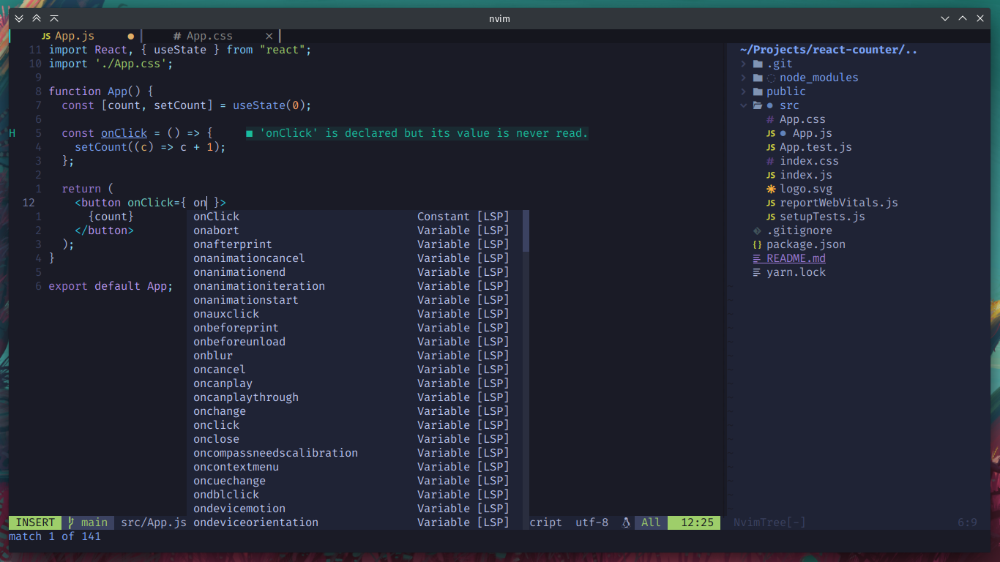

# Nvim-config

A custom neovim config written mostly in Lua with the focus on simplicity and functionality.

## Features
- Uses built-in LSP
- Sane keybindings
- Nvim-tree, barbar, lualine
- Auto changes theme based on time
- Simple file structure
